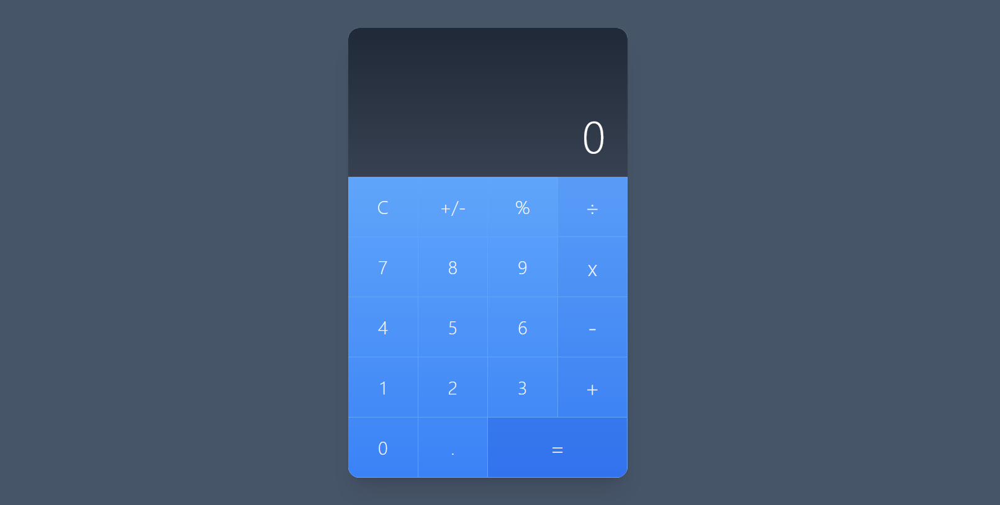

# Gif Expert App

Aplicación desarrollada en **Angular 19.0.1** y **Tailwind CSS** como parte del curso *"Angular Pro: Lleva tus bases al siguiente nivel"* de **Fernando Herrera**. Es una implementación práctica que destaca las nuevas características de las nuevas versiones de Angular.  

---

## Características implementadas 
- **Zoneless**
- **OnPush Change Detection**
- **ViewEncapsulation** 
- **Input Signals** 
- **Standalone Components** 
- **Host Bindings** 

---

## Instalación y ejecución

1. Clona este repositorio en tu máquina local `git clone https://github.com/fhidalgorosabal/calculator.git`.
2. Accede a la carpeta del proyecto `cd calculator`.
3. Ejecuta `npm install` para instalar los paquetes de node.
4. Para iniciar la aplicación `ng serve` y accede en el navedador a `http://localhost:4200/`.
   
---   

## Aplicación

Puedes acceder a la aplicación desplegada aquí: [Calculator](https://calculator-fhr.netlify.app/calculator)

---

## Autor

Desarrollado por: Fernando Hidalgo Rosabal.

---

## Licencia

Este proyecto está licenciado bajo la [Licencia MIT](https://opensource.org/licenses/MIT).

---
